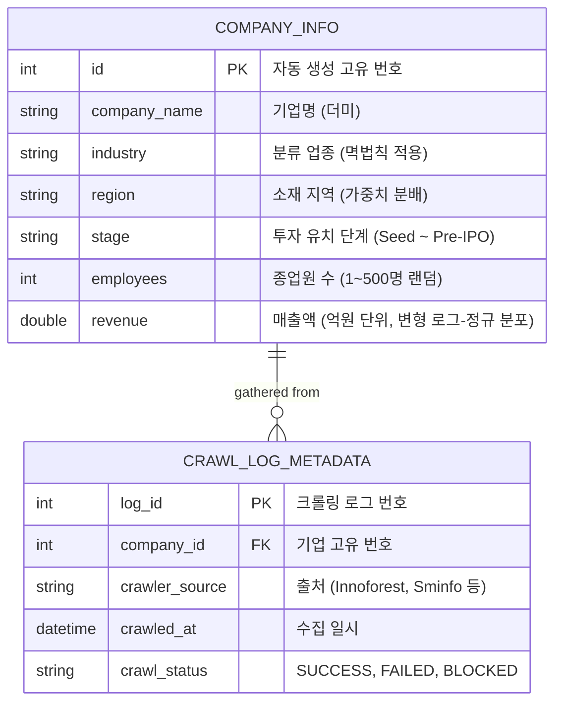

# The Peak Data Model (ERD)

과거의 거대한 `크롤링_숲.erd` (JSON) 파일을 대체하는 경량화 및 최적화된 데이터 모델 명세서입니다.
The Peak의 기업 데이터 파이프라인 구축을 통해 정제된 최종 데이터 모델(Target Model)과 크롤링 메타데이터 관계를 구조화하여 보여줍니다.

```mermaid
erDiagram
    COMPANY_INFO {
        int id PK "자동 생성 고유 번호"
        string company_name "기업명 (더미)"
        string industry "분류 업종 (멱법칙 적용)"
        string region "소재 지역 (가중치 분배)"
        string stage "투자 유치 단계 (Seed ~ Pre-IPO)"
        int employees "종업원 수 (1~500명 랜덤)"
        double revenue "매출액 (억원 단위, 변형 로그-정규 분포)"
    }
    
    CRAWL_LOG_METADATA {
        int log_id PK "크롤링 로그 번호"
        int company_id FK "기업 고유 번호"
        string crawler_source "출처 (Innoforest, Sminfo 등)"
        datetime crawled_at "수집 일시"
        string crawl_status "SUCCESS, FAILED, BLOCKED"
    }

    COMPANY_INFO ||--o{ CRAWL_LOG_METADATA : "gathered from"
```
