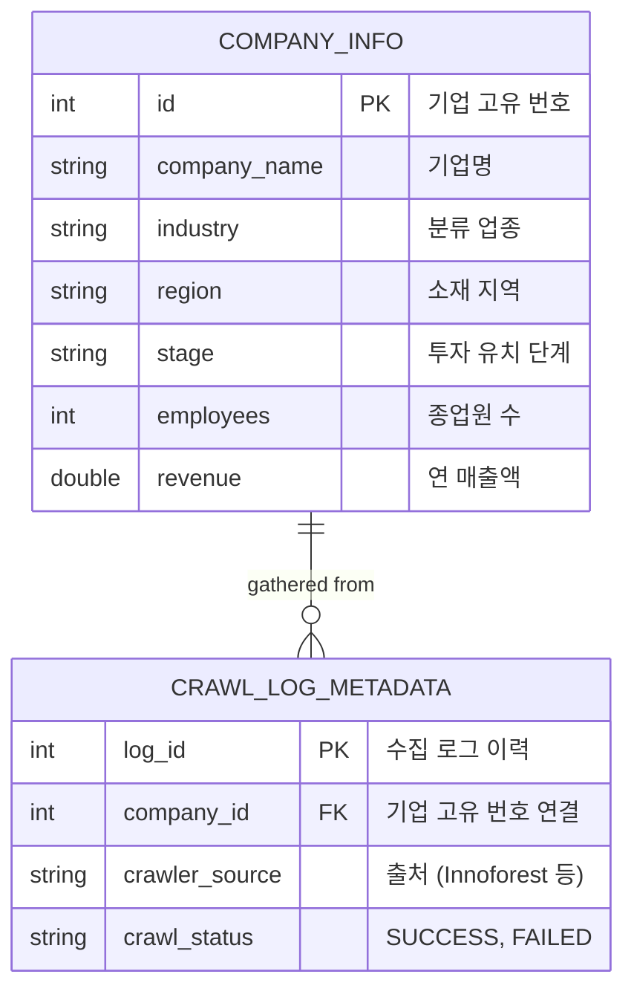

# 🚀 더선한 주식회사 데이터 파이프라인 전담 (인턴) 포트폴리오

## 📌 기본 정보
- **근무처:** 더선한 주식회사 (AI 서비스 벤처)
- **근무 기간:** 2024.11 ~ 2024.12 (2개월)
- **역할:** 데이터팀 전담 인턴 (데이터 수집 관리, 파이프라인 구축, 경영진 보고용 대시보드 시각화)
- **주요 성과 요약:** 데이터 파이프라인 완전 자동화로 MVP 개발 기간 80% 단축 및 정합성 98.5% 통합 DB(13만 기업) 구축. 이를 바탕으로 RAG/HyDE 아키텍처 제안.

---

## 1. 🚨 문제 상황 (Problem)
사내 비즈니스 매칭 플랫폼 'The Peak' MVP 개발 및 AI 서비스 고도화를 위해 **정합성 높은 대규모 기업 데이터**가 절실히 필요했습니다.
1. **[초기 데이터 부재 및 불량]**
   기존에 보유한 13만 개의 데이터는 곳곳에 파편화되어 있고 중복/결측치가 많아 정합성이 60%에 불과하여, 머신러닝에 활용할 수 없는 가비지 데이터였습니다.
2. **[크롤링 시스템의 한계 (Before 최적화)]**
   내가 합류하기 이전의 크롤링 시스템(주피터 노트북 환경)은 대기 시간(time.sleep)에 의존하고 있어 매우 느렸고, 특히 특정 기관(이노포레스트, 중소벤처기업부 등)에서 **SSL 인증 오류나 봇(Bot) 감지로 인한 IP 차단**이 빈번하게 발생하여 수집이 중단되는 치명적인 결함이 있었습니다.
3. **[경영진 보고 및 가설 검증의 부재]**
   수집된 데이터가 실제로 매칭 AI 서비스의 재료로서 얼마나 가치가 있는지 직관적으로 입증할 수 있는 수단이 없었습니다.

---

## 2. 💡 해결 전략 및 실행 (Action)

### A. 크롤링 파이프라인 자동화 및 보안 우회 구현 (Refactoring)
기존의 불안정한 `.ipynb` 수집 코드를 완벽한 무인 자동화 파이썬 스크립트(`.py`)로 뜯어고쳤습니다.
- **방화벽/봇 감지 우회:** `fake_useragent` 라이브러리로 헤더를 실시간 로테이션하고, 크롬의 `webdriver` 속성을 자바스크립트로 지우는 등 고도화된 우회 로직 설계.
- **SSL 우회 및 세션 관리:** 중기부 사이트의 인증서 에러를 무시하는 `verify=False` 세션 관리와, `BeautifulSoup(BS4)` 기반의 빠르고 가벼운 요청(Request) 병행.
- **Headless 모드 및 동적 대기:** 크롬 창을 띄우지 않는 렌더링으로 리소스를 절감하고, 명시적 대기(`WebDriverWait`)를 도입해 서버 차단 위험 축소.

### B. 파이프라인 정제와 최종 ERD 모델링
크롤링된 이질적인 Raw Data를 [수집 → 정제 → 표준화 → 중복 제거 → 적재]의 5단계 파이프라인을 거쳐 하나의 표준화된 DB로 탈바꿈 시켰습니다. 

**👇 (첨부 자료: 수립한 최종 데이터 구조 모델)**

### C. 경영진 보고용 Streamlit 대시보드 구축 (내부 보고용)
구축한 데이터들이 사업적 가치가 있음을 경영진(C-Level)에게 시각적으로 보고하고, 차세대 AI 서비스의 든든한 재료임을 증명하기 위해 **Streamlit 기반 대시보드 리포트**를 개발했습니다. 
- 시뮬레이션을 위해 메모리상에서 즉시 13만 개의 더미 데이터를 멱법칙 기반으로 뿌려, 로컬 I/O 낭비 없이 리포트를 생성하는 퍼포먼스 최적화 구현.
- **Plotly Express**를 활용하여 지역(Region) 및 투자 유치 단계(Stage) 분포 등을 시각화함으로써, "Seed ~ Pre-A 범위의 잠재 매칭 풀이 5.8만 개 확보됨"을 성공적으로 증명.

---

## 3. 🏆 비즈니스 임팩트 및 성과 (Result)

1. **데이터 처리 효율 압도적 개선:** 자동화 파이프라인 구축을 통해 데이터 확보 및 정제 시간을 **80% 이상 단축**하였으며, 1개월 내에 MVP에 필요한 핵심 데이터 조달을 완수.
2. **AI 서비스 기반 마련 (정합성 98.5%):** 60%에 불과했던 기존 데이터 품질을 고도화하여 단일 데이터셋으로 묶어냄. 결과적으로 **AI 추천 알고리즘 특허 출원**의 100% 토대가 됨.
3. **경영진의 비즈니스 가설 검증:** 대시보드를 통해 데이터의 분포를 증명함으로써 플랫폼의 핵심 고객 모델링(매칭 효율 93% 향상 및 고객 비용 절감 가설)에 확신 제공.

---

## 4. 🧠 Next Step: RAG & HyDE 적용 설계 제안
성공적으로 데이터 인프라 구축 인턴십을 마무리하며, **이 풍부한 기업 데이터들을 바탕으로 향후 매칭 AI를 어떻게 고도화할 것인가**에 대한 청사진(개념 설계)을 사장님께 제출했습니다.
- RAG 아키텍처의 한계를 짚고, 이를 타파하기 위해 질문과 가장 유사한 "가상의 이상적 매칭 문서"를 선제적으로 그려내는 **HyDE (Hypothetical Document Embeddings)** 방법론을 제안.
- **관련 출판물:** [HyDE로 RAG 향상시키기: 이론과 적용 방안 (공동 저자)](https://www.koreaodm.com/인공지능/hyde로-rag-향상시키기-이론과-적용-방안/) 
